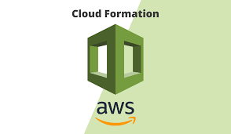

# AWS CloudFormation

  

## What is AWS CloudFormation?

AWS CloudFormation is a service that gives developers and businesses an easy way to create a collection of related AWS and third party resources and provision them in an orderly and predictable fashion.

[Official Documentation](https://docs.aws.amazon.com/AWSCloudFormation/latest/UserGuide/Welcome.html)

## Templates

[s3bucket.yaml](templates/s3bucket.yaml) - simple CloudFormation Template that creates S3Bucket. 

[taggeds3bucket.yaml](templates/taggeds3bucket.yaml) - simple CloudFormation Template that creates S3Bucket with Tags. 

[parameterizeds3bucket.yaml](templates/parameterizeds3bucket.yaml) - simple CloudFormation Template that creats S3Bucket based on the following parameter inputs:

    - MyBucketName   

    - TeamTagValue

    - EnvTagValue 

[securitygroup.yaml](templates/securitygroup.yaml) - simple CloudFormation Template that creates SecurityGroup with Tags, and requires the following parameteres : 

    - SGName  - name for the resource
    - MyVpc   - VpcId for which the SG will be created. 
